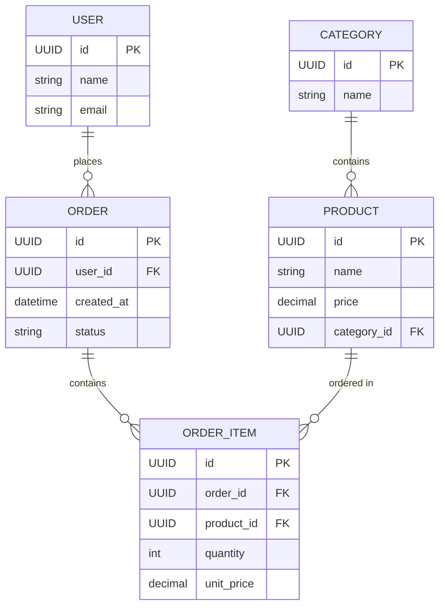

```mermaid
erDiagram
    USER {
        UUID id PK
        string name
        string email
    }

    CATEGORY {
        UUID id PK
        string name
    }

    PRODUCT {
        UUID id PK
        string name
        decimal price
        UUID category_id FK
    }

    ORDER {
        UUID id PK
        UUID user_id FK
        datetime created_at
        string status
    }

    ORDER_ITEM {
        UUID id PK
        UUID order_id FK
        UUID product_id FK
        int quantity
        decimal unit_price
    }

    USER ||--o{ ORDER : places
    CATEGORY ||--o{ PRODUCT : contains
    ORDER ||--o{ ORDER_ITEM : contains
    PRODUCT ||--o{ ORDER_ITEM : "ordered in"
```