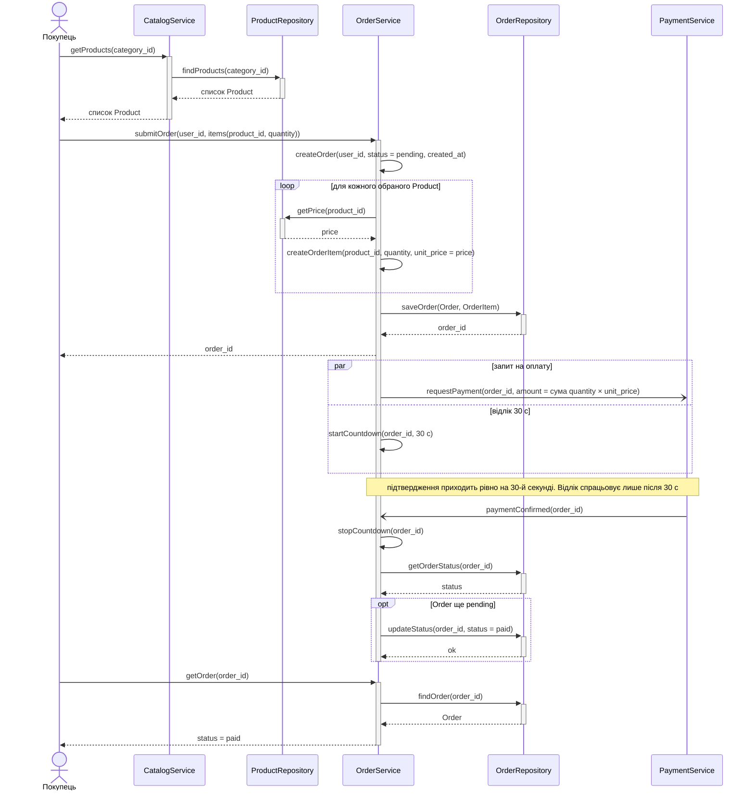
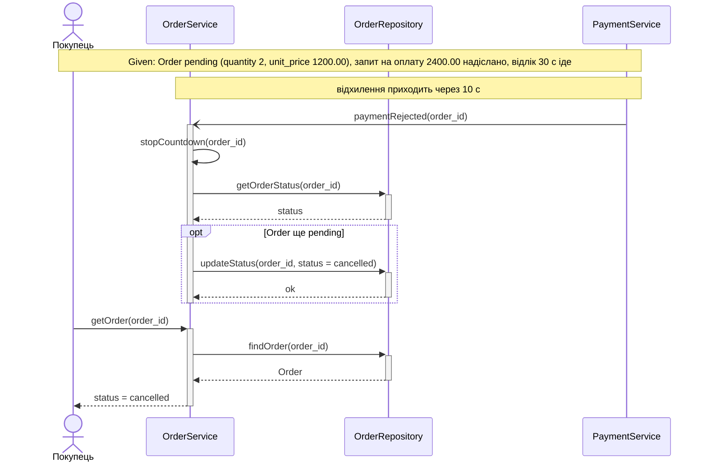
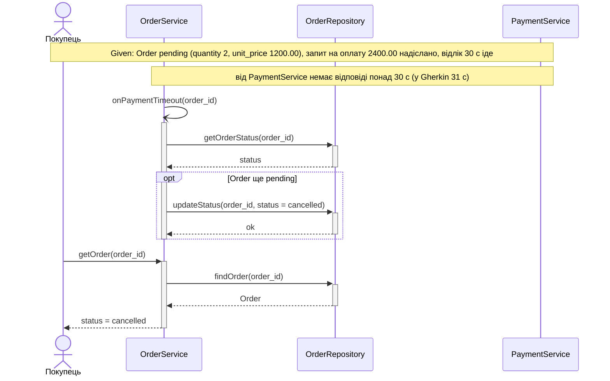

# Sequence-діаграми UC-02 «Оформити й оплатити замовлення»

## S1 — Оплата підтверджена не пізніше ніж за 30 с

```mermaid
sequenceDiagram
    actor B as Покупець
    participant C as CatalogService
    participant PR as ProductRepository
    participant O as OrderService
    participant OR as OrderRepository
    participant PS as PaymentService

    B->>+C: getProducts(category_id)
    C->>+PR: findProducts(category_id)
    PR-->>-C: список Product
    C-->>-B: список Product

    B->>+O: submitOrder(user_id, items(product_id, quantity))
    O->>O: createOrder(user_id, status = pending, created_at)
    loop для кожного обраного Product
        O->>+PR: getPrice(product_id)
        PR-->>-O: price
        O->>O: createOrderItem(product_id, quantity, unit_price = price)
    end
    O->>+OR: saveOrder(Order, OrderItem)
    OR-->>-O: order_id
    O-->>B: order_id

    par запит на оплату
        O-)PS: requestPayment(order_id, amount = сума quantity × unit_price)
    and відлік 30 с
        O->>O: startCountdown(order_id, 30 с)
    end

    Note over O,PS: підтвердження приходить рівно на 30-й секунді. Відлік спрацьовує лише після 30 с
    PS-)O: paymentConfirmed(order_id)
    O->>O: stopCountdown(order_id)
    O->>+OR: getOrderStatus(order_id)
    OR-->>-O: status
    opt Order ще pending
        O->>+OR: updateStatus(order_id, status = paid)
        OR-->>-O: ok
    end
    deactivate O

    B->>+O: getOrder(order_id)
    O->>+OR: findOrder(order_id)
    OR-->>-O: Order
    O-->>-B: status = paid
```

## S2 — Платіжний сервіс відхиляє оплату

```mermaid
sequenceDiagram
    actor B as Покупець
    participant O as OrderService
    participant OR as OrderRepository
    participant PS as PaymentService

    Note over B,PS: Given: Order pending (quantity 2, unit_price 1200.00), запит на оплату 2400.00 надіслано, відлік 30 с іде
    Note over O,PS: відхилення приходить через 10 с
    PS-)+O: paymentRejected(order_id)
    O->>O: stopCountdown(order_id)
    O->>+OR: getOrderStatus(order_id)
    OR-->>-O: status
    opt Order ще pending
        O->>+OR: updateStatus(order_id, status = cancelled)
        OR-->>-O: ok
    end
    deactivate O

    B->>+O: getOrder(order_id)
    O->>+OR: findOrder(order_id)
    OR-->>-O: Order
    O-->>-B: status = cancelled
```

## S3 — Відповіді немає понад 30 с

```mermaid
sequenceDiagram
    actor B as Покупець
    participant O as OrderService
    participant OR as OrderRepository
    participant PS as PaymentService

    Note over B,PS: Given: Order pending (quantity 2, unit_price 1200.00), запит на оплату 2400.00 надіслано, відлік 30 с іде
    Note over O,PS: від PaymentService немає відповіді понад 30 с (у Gherkin 31 с)
    O-)+O: onPaymentTimeout(order_id)
    O->>+OR: getOrderStatus(order_id)
    OR-->>-O: status
    opt Order ще pending
        O->>+OR: updateStatus(order_id, status = cancelled)
        OR-->>-O: ok
    end
    deactivate O

    B->>+O: getOrder(order_id)
    O->>+OR: findOrder(order_id)
    OR-->>-O: Order
    O-->>-B: status = cancelled
```