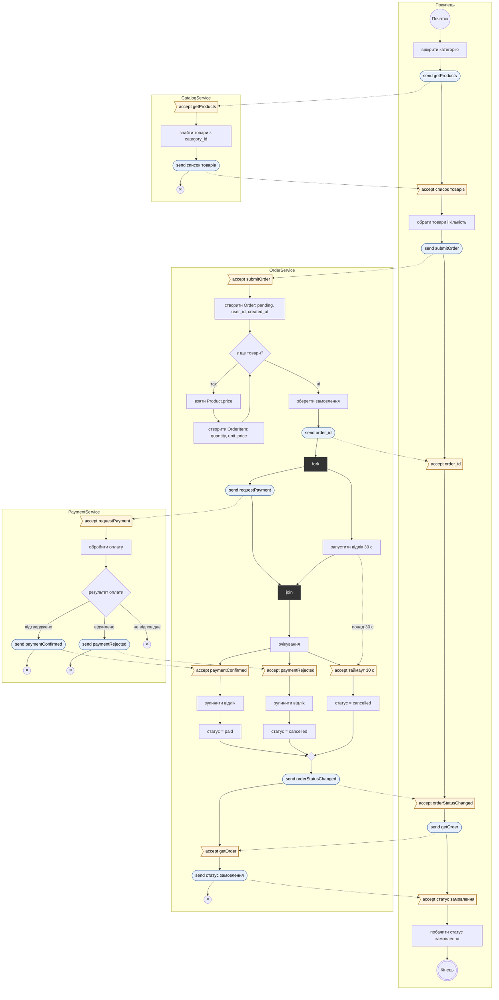

# Activity-діаграма: процес UC-02

```mermaid
flowchart TB

    subgraph BUY["Покупець"]
        b0(("Початок"))
        b1["відкрити категорію"]
        b2(["send getProducts"]):::send
        b3>accept список товарів]:::accept
        b4["обрати товари і кількість"]
        b5(["send submitOrder"]):::send
        b6>accept order_id]:::accept
        b7>accept orderStatusChanged]:::accept
        b8(["send getOrder"]):::send
        b9>accept статус замовлення]:::accept
        b10["побачити статус замовлення"]
        b11((("Кінець")))

        b0 --> b1 --> b2 --> b3 --> b4 --> b5 --> b6 --> b7 --> b8 --> b9 --> b10 --> b11
    end

    subgraph CAT["CatalogService"]
        c1>accept getProducts]:::accept
        c4["знайти товари з category_id"]
        c2(["send список товарів"]):::send
        c3(("✕"))

        c1 --> c4 --> c2 --> c3
    end

    subgraph ORD["OrderService"]
        o1>accept submitOrder]:::accept
        o2["створити Order: pending, user_id, created_at"]
        o3{"є ще товари?"}
        o4["взяти Product.price"]
        o5["створити OrderItem: quantity, unit_price"]
        o6["зберегти замовлення"]
        o7(["send order_id"]):::send
        F["fork"]:::bar
        o8(["send requestPayment"]):::send
        o9["запустити відлік 30 с"]
        J["join"]:::bar
        o10["очікування"]
        o11>accept paymentConfirmed]:::accept
        o12>accept paymentRejected]:::accept
        o13>accept таймаут 30 с]:::accept
        o14["зупинити відлік"]
        o15["зупинити відлік"]
        o16["статус = paid"]
        o17["статус = cancelled"]
        o18["статус = cancelled"]
        M{" "}
        o19(["send orderStatusChanged"]):::send
        o20>accept getOrder]:::accept
        o21(["send статус замовлення"]):::send
        o22(("✕"))

        o1 --> o2 --> o3
        o3 -->|так| o4 --> o5 --> o3
        o3 -->|ні| o6 --> o7 --> F
        F --> o8 --> J
        F --> o9 --> J
        J --> o10
        o10 --> o11 --> o14 --> o16 --> M
        o10 --> o12 --> o15 --> o17 --> M
        o10 --> o13 --> o18 --> M
        M --> o19 --> o20 --> o21 --> o22
    end

    subgraph PAY["PaymentService"]
        p1>accept requestPayment]:::accept
        p2["обробити оплату"]
        p3{"результат оплати"}
        p4(["send paymentConfirmed"]):::send
        p5(["send paymentRejected"]):::send
        p6(("✕"))
        p7(("✕"))
        p8(("✕"))

        p1 --> p2 --> p3
        p3 -->|підтверджено| p4 --> p6
        p3 -->|відхилено| p5 --> p7
        p3 -->|не відповідає| p8
    end

    b2 -.-> c1
    c2 -.-> b3
    b5 -.-> o1
    o7 -.-> b6
    o8 -.-> p1
    p4 -.-> o11
    p5 -.-> o12
    o19 -.-> b7
    b8 -.-> o20
    o21 -.-> b9
    o9 -.->|понад 30 с| o13

    classDef send fill:#e8f0fe,stroke:#4a6fa5,color:#000
    classDef accept fill:#fff4e0,stroke:#b07d2b,color:#000
    classDef bar fill:#333,stroke:#999,color:#fff
```